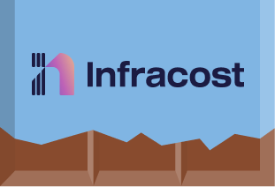

[](https://community.chocolatey.org/packages/infracost)

# Chocolatey Packages

Chocolatey definition files for infracost.

## Getting started

To install the Infracost CLI through chocolatey simply run:

```bash
choco install infracost
```

You can visit our community package page [here](https://community.chocolatey.org/packages/infracost)

## Contributing

This repository automates the chocolatey releases for Infracost using GitHub actions. The chocolatey release workflow is triggered by the main Infracost release.
Each package (just the Infracost CLI choco package currently) has a `build.ps1` powershell file that uses builds a valid chocolatey package using the files found under the [templates](./infracost/templates) folder.
The GitHub workflow dynamically inserts version and checksum information at runtime then builds and tests the choco package, before pushing it to the publisher page.